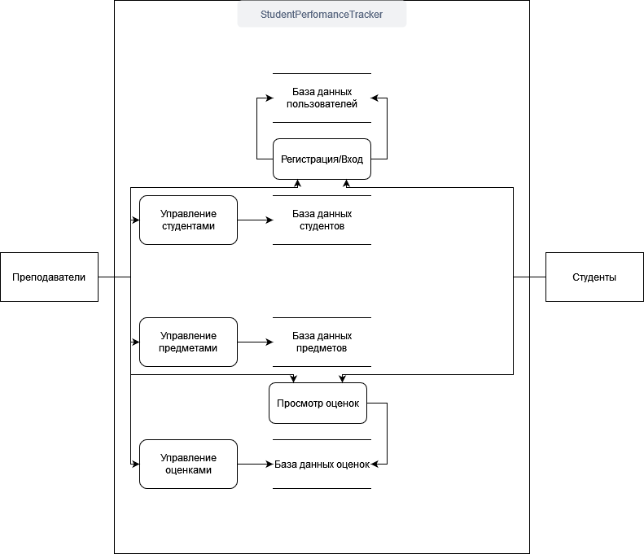

# Scored

## Описание проекта

Scored — это веб-приложение для управления успеваемостью студентов. Преподаватели могут добавлять и редактировать информацию о студентах, учебных планах и оценках, а студенты могут просматривать свои результаты.

## Установка с использованием Docker

Для установки и запуска проекта с использованием Docker выполните следующие шаги:

1. Клонируйте репозиторий:
    ```bash
    git clone https://github.com/5ilen/Scored.git
    ```

2. Перейдите в директорию проекта:
    ```bash
    cd Scored
    ```

3. Постройте Docker-образ:
    ```bash
    docker-compose build
    ```

4. Запустите контейнеры:
    ```bash
    docker-compose up -d
    ```

5. Выполните миграции базы данных:
    ```bash
    docker-compose run web flask db init
    docker-compose run web flask db migrate -m "Initial migration"
    docker-compose run web flask db upgrade
    ```

6. Запустите приложение:
    ```bash
    docker-compose up
    ```

Приложение будет доступно по адресу `http://localhost:5000`.

## Дополнительные команды

Если вам нужно сбросить и заполнить базу данных начальными данными, выполните следующие команды:
    
    docker-compose run web python reset_db.py
    docker-compose run web python seed_db.py

Приложение будет доступно по адресу `http://localhost:5000`.

## Схемы

### Use Case Diagram


### Data Flow Diagram (DFD)



### Entity Relationship Diagram (ERD)


## Структура проекта

- `app/` — основной код приложения
  - `__init__.py` — инициализация приложения и конфигурация базы данных
  - `routes/` — маршруты приложения
  - `models/` — модели базы данных
  - `forms/` — формы ввода
  - `templates/` — HTML шаблоны
  - `static/` — статические файлы (CSS, JS, изображения)
- `reset_db.py` — скрипт для сброса базы данных
- `seed_db.py` — скрипт для заполнения базы данных начальными данными
- `run.py` — запуск приложения
- `requirements.txt` — зависимости проекта

## Контакты

Для вопросов и предложений обращайтесь по адресу: [silennemoy@gmail.com](mailto:silennemoy@gmail.com)
